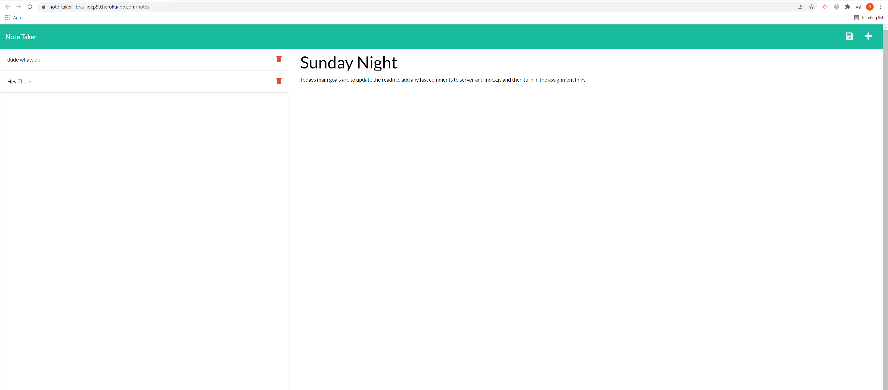

# Note_taker_ExpressJS

The purpose of this assignment is to modify starter code to create an application called Note Taker that can be used to write and save notes. This application will use an Express.js back end and will save and retrieve note data from a JSON file.

There are three main objectives which are to build the back end, connect  it to the application's front end and then deploy the entire application to Heroku.


## User Story

```
AS A small business owner
I WANT to be able to write and save notes
SO THAT I can organize my thoughts and keep track of tasks I need to complete
```

## Usage

The following images show the web application's appearance and functionality:




## Link to Deployed Site

https://note-taker--brauliocp59.herokuapp.com/notes
